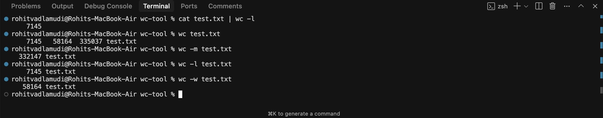

# Unix Command Line Tool -> wc-tool
Python implementation of Unix Command Line Tool for Word, Line, Byte, and Character Counting (like wc)
wc-tool is a simple yet effective command-line tool written in Python that mimics the functionality of the popular Unix utility wc. It counts the number of words, lines, bytes, and characters in a file or standard input.



### Features
- Counts words, lines, bytes, and characters
- Supports reading from files or standard input
- Detailed output with options to show individual counts 

## Getting Started

Follow the steps below to get started with the wc-tool:

1. Clone the repository using Git:

   ```bash
   git clone https://github.com/TRohit20/wc-tool.git
   ```

2. Change to the project directory:

   ```bash
   cd wc-tool
   ```

3. Run the tool:

   ```bash
   python wc.py
   or
   wc -[flags] [filename]
   ```


Flags:
  -c, --count      Outputs the numbers of bytes in the file
  -h, --help       help for wc-tool
  -l, --lines      Outputs the numbers of lines in the file
  -m, --chars      Outputs the numbers of characters in the file
  -w, --words      Outputs the numbers of words in the file
```

By default, wc-tool outputs the number of words, lines, bytes, and characters for the file. You can use the `-m` and `-c` flags to display only characters and bytes, and `-w` and `-l` to focus on words or lines respectively.

Example: Get the number of words of a file `test.txt`
```bash
./wc-tool -w test.txt
```